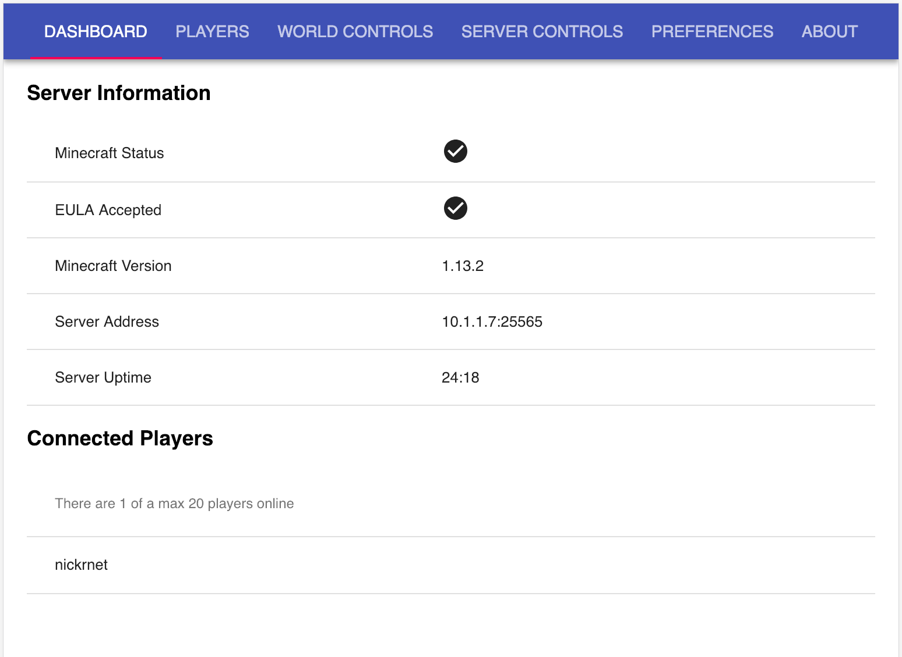
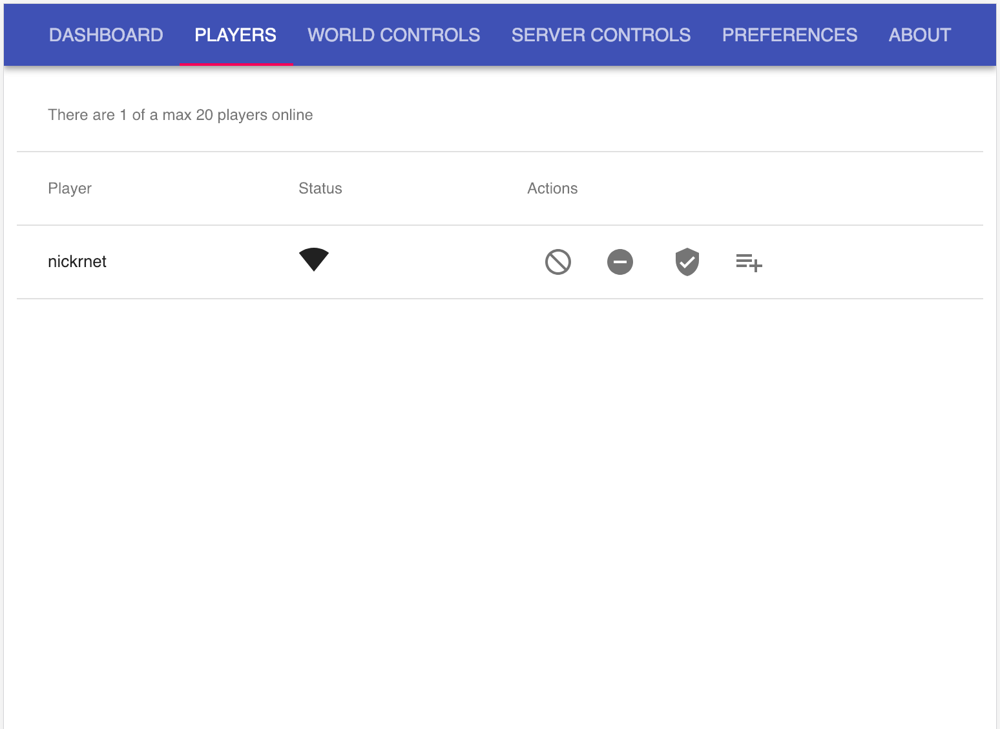
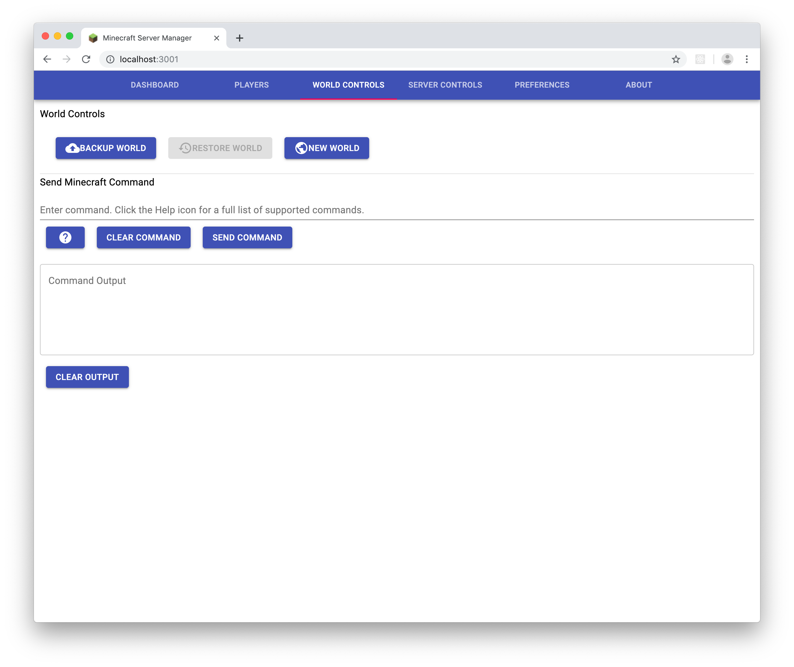
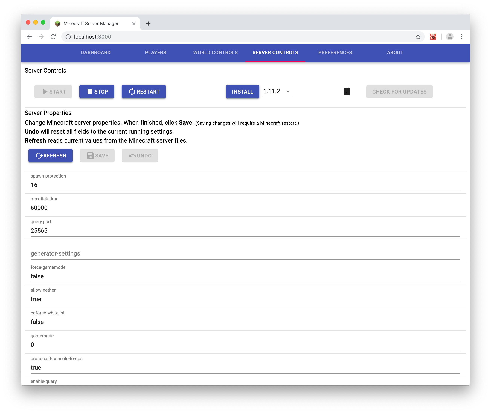

# minecraft-server-manager

A browser-based management interface for Minecraft Server.

Includes:

* a Node.js script to control your Minecraft server instance
* a set of web pages for management created using React

Dashboard


Player Management


World Controls


Server Controls


## Requirements

Node.js 10.x or greater LTS release.

## Installation

1. In a Terminal or Command Prompt, execute
```
    git clone https://github.com/nickrnet/minecraft-server-manager.git
    pushd minecraft-server-manager && npm install
    pushd minecraftservermanager && npm install
    popd && popd
```

2. If desired, edit the IP address and port properties at the top of the
`minecraft-api.js`
script. By default, the web server will run on `localhost` on port 3001.

## Running Minecraft Server Manager

1. Execute

```
    pushd minecraft-server-manager && npm run start
```

If a Minecraft server executable is not discovered, one can be installed from the
Server Controls tab.

2. Navigate to your web server's URL: http://localhost:3001
3. Start the Minecraft server and/or accept the Minecraft end user license
agreement if needed.
4. Play multiplayer Minecraft on your server. *(usually requires paid
Minecraft account)*
5. Manage things on the Minecraft server via the web interface.

## Notes

### SECURITY NOTICE

The web application is provided "as-is". There is more than likely risk of
abuse to your Minecraft server by using this application, as there is "little to
no" security in the web application at all. Securing the machine and access to
the web application is the responsibility of the person running the Minecraft
server.

### Testing

Current OS testing has been with:

* Ubuntu 16.04, 18.04
* CentOS 7
* OS X Sierra (10.12) and higher
* Node.js 10.16.0

That is not to say that it will not run on Windows - it should, but it has
not been tested.

## Logging Issues

There are no doubt bugs waiting to be discovered, and features missing outright.
Feel free to check the
[minecraft-server-manager issues](https://github.com/nickrnet/minecraft-server-manager/issues)
page and log an issue if it doesn't exist as issues are discovered. Realize that
there is no schedule for this project, so a bug fix or enhancement will be
completed as time allows, regardless of severity, crash, or payment, at the
developer's discretion. For that matter if you are able, fork the project and
PR a bug fix back. We'll add you to the About page if the PR is merged.

### Known Issues

- Accepting the Minecraft end user license agreement (EULA) requires the
Minecraft server to have been run once.
- The Restore Backup button of the World Controls is permanently disabled while
work on that feature continues.
- The Server Properties section of the Server Controls is not editable.

There are more, but these are the most annoying ones discovered to date.

## Helpful Hints

If you have a Minecraft world already running and want to use this web
application to manage it, simply copy the contents of your Minecraft directory
to the `minecraft_server` location and then start the web application.

If anything goes awry with game play, typically a restart of the web application
will resolve issues. If there are too frequent or disasterly issues, simply run
your Minecraft server the way you did before and check the Issues page.
